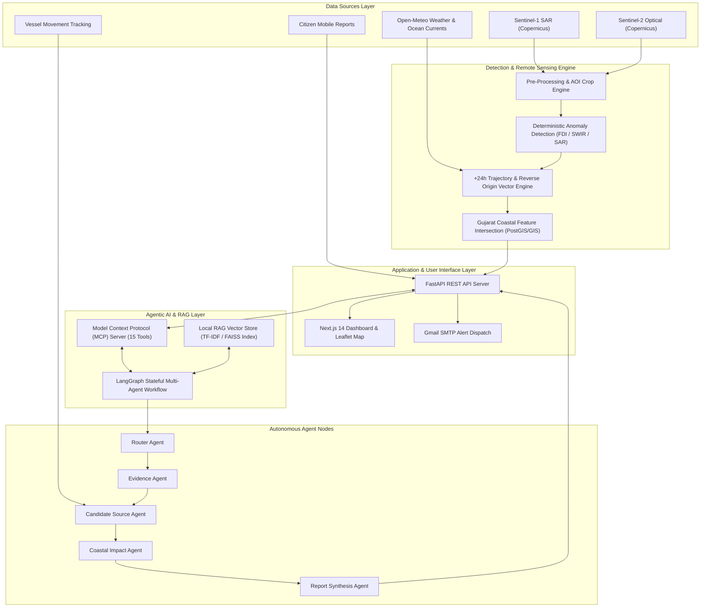

# 🌊 MarineGuard AI — Platform Documentation & Complete System Specification

<div align="center">

| **FORM ID** | **DOCUMENT SPECIFICATION FORM** | **SYSTEM REVISION** | **OPERATIONAL STATUS** | **SECURITY CLASSIFICATION** |
| :---: | :---: | :---: | :---: | :---: |
| `MG-SPEC-2026-V7-FINAL` | **MarineGuard AI Complete System Specification** | `v7.0.0` | `PRODUCTION-READY` | `OPEN-SOURCE / PUBLIC` |

<br/>

[](https://www.python.org/)
[](https://nextjs.org/)
[](https://fastapi.tiangolo.com/)
[](https://langchain-ai.github.io/langgraph/)
[](https://modelcontextprotocol.io/)
[](LICENSE)

</div>

---

## 📋 System Metadata & Formal Specification Form

> [!NOTE]
> This formal specification document provides a comprehensive technical overview of **MarineGuard AI**—covering its multi-agent architecture, remote sensing engines, mathematical formulations, incident state lifecycle, visual evidence generation, citizen reporting, and operational deployment guide.

| Specification Field | Detailed Record & System Capabilities |
| :--- | :--- |
| **System Name** | **MarineGuard AI** — Multi-Source Agentic Marine Pollution Early-Warning, Investigation & Response System |
| **Primary Domain** | Marine Pollution Detection, Hydrodynamic Spill Tracking, Impact Assessment & Coastal Risk Intelligence |
| **Primary Study Area** | Gulf of Khambhat & Surat-Hazira Coastal Waters, Gujarat, India ($21.17^\circ\text{N}, 72.83^\circ\text{E}$) |
| **Core AI Architecture** | Stateful LangGraph Multi-Agent Orchestration + Model Context Protocol (15 Tools) + Local RAG Engine |
| **Data Sources** | Copernicus Sentinel-1 (C-Band SAR), Sentinel-2 (MSI Optical Level-2A), Open-Meteo Marine API, Citizen Reports |
| **Domain Knowledge Base** | Local Vector Store indexing Indian Maritime Law, MARPOL Annex I/V, Coast Guard SOPs & Oceanography |
| **Supported Anomaly Classes** | `NORMAL`, `SURFACE_ANOMALY`, `OIL_LIKE_ANOMALY`, `FLOATING_MATERIAL_CANDIDATE`, `HIGH_TURBIDITY_EVENT`, `UNKNOWN` |
| **Incident Lifecycle States**| `DETECTED` $\rightarrow$ `INVESTIGATING` $\rightarrow$ `VERIFIED` $\rightarrow$ `ACTION_REQUIRED` $\rightarrow$ `MONITORING` $\rightarrow$ `RESOLVED` / `FALSE_POSITIVE` |
| **Evidence & Visualization** | Raw JP2 Band Extraction, RGB Composites, Contour Anomaly Outlines, Before/After Image Comparison Engine |
| **Notification Subsystem** | Automated Gmail SMTP Dispatch + Quick-Fill NGO Contact Integration (`keval8532@gmail.com`, etc.) |
| **Command Center UI** | Next.js 14 App Router, Interactive Leaflet GIS Map, System Diagnostics Panel, Citizen Upload Portal |
| **Licensing** | MIT License — Open-Access Enterprise Coastal Defense Architecture |

---

## 📑 Table of Contents

1. [Executive Overview & Operational Vision](#1-executive-overview--operational-vision)
2. [System Boundaries Form (Capabilities vs Limits)](#2-system-boundaries-form-capabilities-vs-limits)
3. [Architectural Pillars](#3-architectural-pillars)
4. [High-Level System Architecture](#4-high-level-system-architecture)
5. [Autonomous Agents & MCP Tooling Matrix](#5-autonomous-agents--mcp-tooling-matrix)
6. [Deterministic Mathematical & Remote Sensing Formulations](#6-deterministic-mathematical--remote-sensing-formulations)
7. [Incident Lifecycle & Evidence Visualization Subsystem](#7-incident-lifecycle--evidence-visualization-subsystem)
8. [Citizen Reporting, NGO Integration & Email Dispatch](#8-citizen-reporting-ngo-integration--email-dispatch)
9. [Complete Technology Stack Matrix](#9-complete-technology-stack-matrix)
10. [Repository Directory Structure](#10-repository-directory-structure)
11. [Operational Setup & Deployment Guide](#11-operational-setup--deployment-guide)
12. [Empirical Satellite Scene Verification Record](#12-empirical-satellite-scene-verification-record)
13. [Legal Compliance & Non-Accusatory Disclaimer Form](#13-legal-compliance--non-accusatory-disclaimer-form)
14. [Licensing & Governance](#14-licensing--governance)

---

## 1. Executive Overview & Operational Vision

**MarineGuard AI** is a software-based marine pollution intelligence platform engineered to detect, investigate, track, and assess marine surface pollution events in near-real-time.

Instead of operating as a simple image classification script (*"Is pollution present in this image?"*), MarineGuard AI provides answers to a complete operational set of investigation questions:

```text
Possible marine surface anomaly detected
                    ↓
Where is it located? (Lat/Lon, AOI Tile, Coastal Distance)
                    ↓
What evidence supports the detection? (FDI, SWIR, SAR Dark-Patch)
                    ↓
What is the multi-sensor confidence rating? (C_total %)
                    ↓
Where could the pollution have originated? (Reverse Origin Vector)
                    ↓
Are vessels, ports, rivers, or industrial sites nearby? (GIS Feature Matching)
                    ↓
Where will the pollutant move next? (+24h Hydrodynamic Drift Physics)
                    ↓
Which coastal habitats or mangroves are at risk? (Environmental Impact Score)
                    ↓
How severe is the threat? (Multi-Criteria Priority Score)
                    ↓
Should an alert be generated? (Automated SMTP Email & Command Center Flag)
```

---

## 2. System Boundaries Form (Capabilities vs Limits)

| System Domain | What MarineGuard AI WILL Do | What MarineGuard AI WILL NOT Do |
| :--- | :--- | :--- |
| **Observation** | Continuously poll Sentinel-1 SAR and Sentinel-2 optical scenes over coastal study zones. | Claim 24/7 continuous second-by-second satellite surveillance. |
| **Detection** | Flag candidate anomalies (`FLOATING_MATERIAL_CANDIDATE`, `OIL_LIKE_ANOMALY`). | Guarantee that every detected anomaly is confirmed pollution. |
| **Attribution** | Identify candidate source zones and nearby vessel traffic vectors. | Accuse specific ships, companies, ports, or individuals of legal guilt. |
| **Physics Modeling**| Compute deterministic 24-hour forward drift trajectories and reverse origin vectors. | Rely on LLM text generation to invent physical movement numbers. |
| **Evidence Rendering**| Render high-resolution satellite crops, anomaly contour overlays, and before/after comparisons. | Alter or fabricate raw satellite spectral measurement bands. |
| **Reporting** | Generate evidence-grounded legal compliance reports with disclaimers. | Replace maritime enforcement agencies or Coast Guard operational authority. |

---

## 3. Architectural Pillars

| Pillar # | Pillar Title | Technical Implementation Specification |
| :---: | :--- | :--- |
| **01** | **Deterministic Remote Sensing** | All spectral indices (Floating Debris Index, SWIR, NDWI), SAR dark-patch wind-gate rules, ocean current vectors, and priority scores are computed strictly deterministically to eliminate LLM hallucinations. |
| **02** | **Model Context Protocol (MCP)** | Standardized Model Context Protocol server exposing 15 tools across satellite, atmospheric, hydrodynamic, GIS feature intersection, incident management, and alerting services. |
| **03** | **Stateful Multi-Agent Orchestration** | LangGraph-powered stateful graph executing specialized autonomous agents: *Router Agent*, *Evidence Agent*, *Candidate Source Agent*, *Coastal Impact Agent*, and *Report Synthesis Agent*. |
| **04** | **Local Domain RAG Vector Engine** | Local vector store indexing Indian Maritime Law, MARPOL Annex I & V treaties, Indian Coast Guard Standard Operating Procedures (SOPs), and Gulf of Khambhat oceanography. |
| **05** | **Incident Lifecycle Management** | Maintains persistent incident state transitions from initial detection through investigation, verification, action requirement, monitoring, resolution, or false-positive rejection. |
| **06** | **Visual Evidence Generation** | Converts raw Sentinel JP2 bands into annotated evidence images, displaying spectral anomaly outlines, colorized overlays, and historical before/after scene comparisons. |

---

## 4. High-Level System Architecture



---

## 5. Autonomous Agents & MCP Tooling Matrix

### 5.1 LangGraph Autonomous Agents

| Agent Name | Node Identifier | Core Responsibility & Role |
| :--- | :---: | :--- |
| **Router Agent** | `router_node` | Evaluates incoming anomaly signals or citizen reports, determines investigation workflow path, and initializes incident state. |
| **Evidence Agent** | `evidence_node` | Invokes remote sensing tools, evaluates spectral FDI/SAR indices, checks cloud cover, and calculates multi-sensor confidence $C_{total}$. |
| **Candidate Source Agent**| `source_node` | Runs reverse origin vector physics, checks nearby vessel traffic, ports, and industrial discharge points to formulate potential source candidate zones. |
| **Coastal Impact Agent** | `impact_node` | Computes +24-hour forward drift trajectories, intersects vectors with coastal GIS features (mangroves, beaches, aquaculture), and computes priority score $P$. |
| **Report Synthesis Agent**| `report_node` | Queries local legal/MARPOL RAG vector engine and synthesizes a comprehensive 2,000+ character investigation report with non-accusatory disclaimers. |

### 5.2 Model Context Protocol (MCP) Tools (15 Tools)

| Tool # | Tool Name | Functional Scope |
| :---: | :--- | :--- |
| `01` | `get_latest_satellite_scene` | Fetches recent Copernicus Sentinel-1 SAR / Sentinel-2 optical metadata for specified AOI bounding box. |
| `02` | `calculate_fdi_index` | Computes Sentinel-2 NIR/SWIR Floating Debris Index and returns surface anomaly contours. |
| `03` | `evaluate_sar_dark_patch` | Applies Sentinel-1 C-band SAR capillary damping rules under $2.0 \le U_{10} \le 10.0$ m/s wind gates. |
| `04` | `get_environmental_vectors` | Queries Open-Meteo Marine API for 10m surface wind vectors ($U_{10}, V_{10}$) and surface ocean currents. |
| `05` | `calculate_drift_trajectory` | Simulates 24-hour forward hydrodynamic drift path incorporating windage ($3.5\%$) and ocean currents. |
| `06` | `calculate_reverse_origin` | Back-traverses drift vectors to pinpoint probable pollutant candidate spill zones. |
| `07` | `calculate_confidence_rating` | Evaluates multi-sensor agreement, cloud cover penalty, and vector consistency to yield $C_{total} \in [0, 100\%]$. |
| `08` | `calculate_priority_score` | Computes threat priority score $P \in [0.0, 1.0]$ based on anomaly type, coastal proximity, GIS impact, and confidence. |
| `09` | `intersect_coastal_features` | Queries PostGIS/GIS layer for mangrove ecosystems, marine sanctuaries, beaches, and ports near trajectory. |
| `10` | `search_vessel_traffic` | Checks recent vessel traffic positions in candidate origin zones. |
| `11` | `generate_evidence_artifacts` | Generates visual evidence JPEG/PNG artifacts including RGB crops, anomaly outlines, and before/after comparisons. |
| `12` | `query_legal_rag_index` | Queries local vector engine for Indian Maritime Law, MARPOL Annex I/V rules, and Coast Guard SOPs. |
| `13` | `create_incident_record` | Creates a structured incident record in SQLite database. |
| `14` | `update_incident_status` | Executes state transitions (`DETECTED` $\rightarrow$ `INVESTIGATING` $\rightarrow$ `VERIFIED` $\rightarrow$ `ACTION_REQUIRED` $\rightarrow$ `RESOLVED`). |
| `15` | `dispatch_email_alert` | Formats and sends automated SMTP email alerts to response authorities and NGOs. |

---

## 6. Deterministic Mathematical & Remote Sensing Formulations

### 6.1 Sentinel-2 Floating Debris Index (FDI) & Optical Water Masking
Floating plastics and surface waste exhibit high Near-Infrared (NIR, Band 8) and Short-Wave Infrared (SWIR, Band 11) reflectance relative to surrounding water:

$$FDI = R_{NIR} - \left( R_{RED} + (R_{SWIR1} - R_{RED}) \times \frac{\lambda_{NIR} - \lambda_{RED}}{\lambda_{SWIR1} - \lambda_{RED}} \right)$$

### 6.2 Sentinel-1 SAR Dark-Patch & Wind-Gate Validation Rule
Synthetic Aperture Radar (SAR) oil slick detection relies on capillary wave damping. Slicks appear as dark patches under moderate surface wind speeds:

$$2.0 \text{ m/s} \le U_{10} \le 10.0 \text{ m/s}$$

*Candidate anomalies are rejected if $U_{10} < 2.0\text{ m/s}$ (calms/look-alikes) or $U_{10} > 10.0\text{ m/s}$ (high wind mixing).*

### 6.3 Multi-Sensor Evidence Confidence Rating ($C_{total}$)
Evidence confidence $C_{total} \in [0, 100\%]$ combines multi-sensor observations, cloud cover penalty, and vector consistency:

$$C_{total} = w_{sensor} \cdot S_{sensor} + w_{cloud} \cdot \left(1 - \frac{\text{Cloud}\%}{100}\right) + w_{vector} \cdot S_{vector}$$

### 6.4 Pollutant Hydrodynamic Drift Physics & Reverse Origin Location
Surface drift vector $\vec{v}_{drift}$ over elapsed time $\Delta t$:

$$\vec{v}_{drift} = \alpha_{wind} \cdot \vec{v}_{wind} + \beta_{current} \cdot \vec{v}_{current}$$

* **Windage coefficient**: $\alpha_{wind} = 0.035$ ($3.5\%$) with $15^\circ$ Coriolis deflection angle
* **Current coefficient**: $\beta_{current} = 1.00$ ($100\%$ surface current speed)

Reverse origin location (identifying probable candidate spill zones):

$$\vec{p}_{origin} = \vec{p}_{observation} - \vec{v}_{drift} \cdot \Delta t_{lookback}$$

### 6.5 Multi-Criteria Coastal Risk Priority Score ($P$)
Priority score $P \in [0.0, 1.0]$ evaluates coastal threat urgency:

$$P = 0.35 \cdot S_{type} + 0.25 \cdot \left(1 - \frac{D_{coastal\_km}}{50}\right) + 0.20 \cdot S_{gis\_impact} + 0.20 \cdot \left(\frac{C_{total}}{100}\right)$$

---

## 7. Incident Lifecycle & Evidence Visualization Subsystem

### 7.1 State Transition Lifecycle

```text
[ DETECTED ] ──> [ INVESTIGATING ] ──> [ VERIFIED ] ──> [ ACTION_REQUIRED ]
      │                  │                    │                   │
      ▼                  ▼                    ▼                   ▼
[ FALSE_POSITIVE ]  [ MONITORING ]      [ MONITORING ]       [ RESOLVED ]
```

### 7.2 Visual Evidence Image Generation Engine
The system generates 3 distinct visual evidence image artifacts for every incident:
1. **Raw RGB Crop**: High-resolution True Color satellite crop ($10\text{m}$ Sentinel-2 spatial resolution).
2. **Annotated Anomaly Crop**: Overlay showing calculated FDI contour outlines, anomaly area estimate ($\text{km}^2$), and coordinate grid.
3. **Before / After Scene Comparison**: Comparative side-by-side visual analysis comparing historical baseline imagery with current scene observation.

---

## 8. Citizen Reporting, NGO Integration & Email Dispatch

### 8.1 Mobile Citizen Observation Subsystem
Citizens can report coastal sightings via the `/citizen-report` dashboard interface:
- **Photo Upload**: Supports geotagged JPG/PNG image uploads.
- **GPS Coordinates**: Auto-detects device GPS location or allows manual map pin placement.
- **Spatial Verification Engine**: Instantly matches citizen report location with satellite anomaly database within a $5\text{km}$ radius.

### 8.2 Auto-Suggested NGO Contact Integration
When dispatching incident reports, the UI presents an interactive quick-selection panel with nearest verified NGO contact emails for Gujarat coastal defense:
- `keval8532@gmail.com`
- `keval4013@gmail.com`
- `kevalbagadiya41702@gmail.com`

Selecting any contact automatically populates the email recipient field for one-click notification dispatch.

### 8.3 Automated SMTP Email Dispatch
High-priority incidents ($P \ge 0.70$) trigger automated HTML email notifications via Gmail SMTP, attaching full incident summaries, confidence scores, drift vectors, and direct links to satellite evidence images.

---

## 9. Complete Technology Stack Matrix

| Subsystem Layer | Component / Technology | Operational Role & Implementation |
| :--- | :--- | :--- |
| **Backend API** | FastAPI, Python 3.10 | Async REST API endpoints, Pydantic v2 data models, CORS middleware |
| **Database** | SQLite + SQLAlchemy 2.0 | Incident records, evidence artifact metadata, citizen report store |
| **Agentic Framework** | LangGraph, LangChain | Stateful multi-agent graph execution & node transition management |
| **Tool Protocol** | Model Context Protocol (MCP) | 15 specialized tools for satellite, weather, GIS, and legal RAG |
| **RAG Knowledge Base**| Local TF-IDF Vector Store | Indexes Indian Maritime Law, MARPOL Annex I/V, & Coast Guard SOPs |
| **Remote Sensing** | Rasterio, OpenCV, NumPy, Pillow | JP2 band parsing, FDI indexing, water masking, contour rendering |
| **Weather & Hydro** | Open-Meteo Marine API | Real 10m wind vectors ($U_{10}, V_{10}$) & ocean currents for Gulf of Khambhat |
| **Frontend Framework** | Next.js 14, React 18, Tailwind CSS | App Router, responsive dashboard UI, lucide icons, status badges |
| **GIS Mapping Engine** | Leaflet, React-Leaflet | Layered interactive map of Surat-Hazira coast & drift trajectories |
| **Continuous Integr.**| GitHub Actions | Automated incident monitoring workflow (`.github/workflows/monitor.yml`) |

---

## 10. Repository Directory Structure

```text
MarineGuard/
├── .github/
│   └── workflows/
│       └── monitor.yml                  # GitHub Actions scheduled monitoring workflow
├── backend/
│   ├── app/
│   │   ├── agents/                      # LangGraph Multi-Agent Implementation
│   │   │   ├── graph.py                 # Graph compilation & stateful execution logic
│   │   │   ├── state.py                 # MarineIncidentState schema definition
│   │   │   └── nodes/                   # Autonomous agent node functions
│   │   ├── environmental/               # Open-Meteo Weather & Ocean Current vector engine
│   │   ├── mcp/                         # Model Context Protocol server (15 tools)
│   │   ├── models/                      # SQLAlchemy database models & Pydantic schemas
│   │   ├── rag/                         # Local RAG Indexer, loader, and retriever
│   │   ├── satellite/                   # Remote sensing optical & SAR engines
│   │   ├── services/                    # Deterministic math (Drift, Risk, Confidence)
│   │   ├── auth.py                      # Authentication dependency injection
│   │   ├── config.py                    # Application configuration (Pydantic BaseSettings)
│   │   ├── db.py                        # Database engine and session factory
│   │   └── main.py                      # FastAPI application entry point & router mounting
│   ├── storage/
│   │   └── evidence/                    # Visual evidence image artifacts (Raw, Annotated)
│   ├── tests/
│   │   ├── test_agents_mcp_rag.py       # Pytest unit tests for LangGraph, MCP, & RAG
│   │   └── test_backend.py              # Pytest unit tests for REST API & remote sensing
│   └── requirements.txt                 # Backend Python package dependencies
├── frontend/
│   ├── app/                             # Next.js 14 App Router Page Components
│   │   ├── citizen-report/              # Citizen report submission portal
│   │   ├── dashboard/                   # Command center incident monitoring dashboard
│   │   ├── evidence/                    # Satellite evidence image gallery
│   │   ├── incidents/                   # Incident explorer & detailed report view
│   │   ├── map/                         # Interactive Leaflet GIS mapping panel
│   │   ├── system-health/               # Diagnostic metrics & system health panel
│   │   ├── layout.tsx                   # Main layout container with global navigation
│   │   └── page.tsx                     # Landing page overview
│   ├── components/                      # UI components (LeafletMap, EvidenceViewer, RiskBadge)
│   ├── lib/                             # API client, session context, & TypeScript types
│   ├── package.json                     # Frontend npm package manifest
│   └── tailwind.config.ts               # Tailwind CSS design system configuration
├── rag-assets/                          # Domain Knowledge Sources (MARPOL, Coastal SOPs)
│   ├── manifest.json                    # Serialized local vector index
│   └── ...                              # Legal and oceanographic source markdown files
├── scripts/
│   ├── build_rag_index.py               # RAG vector store builder script
│   ├── process_real_sentinel2_zip.py    # Ingests & processes real Sentinel-2 SAFE scene zips
│   └── seed_demo_incident.py            # SQLite initial demo data seeder
├── MarineGuard_AI_Complete_Project_Document_v7.md # Complete System Architecture Document
└── README.md                            # Main System Documentation & Specification Form
```

---

## 11. Operational Setup & Deployment Guide

> [!IMPORTANT]
> System Prerequisites: **Python 3.10+**, **Node.js 20+**, and **Git**.

### 11.1 Environment Configuration Setup
Copy template files to configure environment parameters:
```bash
cp .env.example .env
cp backend/.env.example backend/.env
cp frontend/.env.example frontend/.env.local
```

### 11.2 Backend Virtual Environment & Data Initialization
```bash
# 1. Create and activate Python virtual environment (Windows PowerShell)
python -m venv venv
.\venv\Scripts\Activate.ps1

# 2. Install backend Python dependencies
pip install -r backend/requirements.txt

# 3. Build local RAG Knowledge Base index
python scripts/build_rag_index.py

# 4. Seed initial demo incident data into SQLite database
python scripts/seed_demo_incident.py

# 5. Execute backend Pytest unit test suite
cd backend
python -m pytest tests/
```

### 11.3 Launch API Server
```bash
# Launch FastAPI application server on port 8000
uvicorn app.main:app --reload --port 8000
```
*Interactive API documentation is accessible at `http://localhost:8000/docs`.*

### 11.4 Launch Command Center UI
```bash
# Open a new terminal session and navigate to frontend directory
cd frontend

# Install npm package dependencies
npm install

# Start Next.js development server
npm run dev
```
*Access the MarineGuard Command Center at `http://localhost:3000`.*

---

## 12. Empirical Satellite Scene Verification Record

| Verification Field | Test Execution Result Record |
| :--- | :--- |
| **Ingested Satellite Scene** | `S2A_MSIL2A_20260925T054251_N0513_R005_T42QZJ_20260925T103013.SAFE.zip` |
| **Acquisition Timestamp**| September 25, 2026 @ 05:42:51 UTC |
| **Target Tile / AOI** | Tile `T42QZJ` (Hazira Industrial Zone / Gulf of Khambhat Coast) |
| **Cloud Cover Assessment**| $0.57\%$ (Optimal optical acquisition clarity) |
| **Detection Result** | `FLOATING_MATERIAL_CANDIDATE` (Estimated surface area: $0.003\text{ km}^2$) |
| **Hydrodynamic Vectors**| Wind $5.06\text{ m/s}$ @ $219.0^\circ$, Ocean Current $3.1\text{ m/s}$ @ $156.0^\circ$ |
| **Multi-Agent Output** | Successfully synthesized full 2,000+ character incident investigation report |

---

## 13. Legal Compliance & Non-Accusatory Disclaimer Form

> [!WARNING]
> All automated outputs generated by MarineGuard AI adhere strictly to Indian Maritime Law and International Maritime Organization (IMO) conventions.

* **Non-Accusatory Terminology**: Vessel traffic and anomaly source classifications are explicitly framed using neutral terms such as *"candidate source"* or *"probable origin zone"*.
* **Mandatory Disclaimer**: Reports produced by the synthesis engine state that findings represent empirical geospatial intelligence for coastal verification and do not constitute formal legal liability determination.

---

## 14. Licensing & Governance

This project is open-source software licensed under the **MIT License**. See the [LICENSE](LICENSE) file for complete details.
